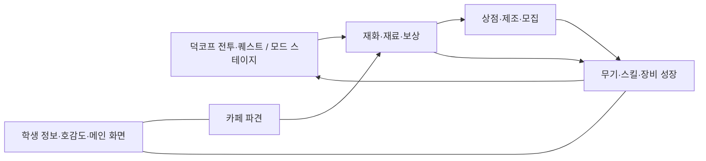

# 원본 모드 学园终端은 어떤 모드인가?

작성일: 2026-10-07 (한국 시간 기준). 대상: Escape from Duckov Workshop `3812418766`, 제공 원본 `info.ini` 버전 `0.4.2`.

## 1. 어떤 모드인지 먼저 설명하면

**덕코프에 블루 아카이브 테마의 메인 화면과 학생·무기 성장 시스템, 재화 경제, 모집, 재료 파밍용 전투 콘텐츠를 추가하는 팬메이드 통합 모드**다.

플레이어는 덕코프 안에서 학원 단말을 열어 학생 정보와 전용 무기를 확인하고, 상점·임무·제조·카페 파견을 이용한다. 연동된 무기를 사용하면 학생에 연결된 전투 스킬과 강화 시스템을 이용하도록 구성되어 있다. 별도의 아비도스 학원 맵과 웨이브 전투도 포함한다.

이 판단은 파일 이름이나 스크린샷만으로 추측한 것이 아니다. 원본 메타데이터, 실제 JSON 설정, 포함된 DLL의 초기화·UI·전투 코드를 함께 확인했다. **실제 게임을 실행해 모든 기능의 작동을 확인한 것은 아니다.** 아래에서 “구현 코드가 있다”와 “지금 이 환경에서 정상 실행된다”를 구분한다.

## 2. 원본 이름과 제작자가 설명하는 성격

| 항목 | 원본 정보 |
|---|---|
| 내부 이름 | `学园终端` |
| 표시 이름 | `蔚蓝档案の学园终端(玩法拓展x专属地图x养成)` |
| 이름의 의미 | 블루 아카이브의 학원 단말. 괄호는 플레이 확장·전용 맵·육성을 뜻한다. |
| Workshop ID | `3812418766` |
| 제공 버전 | `0.4.2` |
| 제작자 표기 | `星夜幻猫` — 원본 description에 적힌 이름 |
| 제작자 설명 | 블루 아카이브 팬메이드 모드, 비영리 동인 작품 |
| 원본 태그 | UI, Visual Enhancements, Quality of Life |

`info.ini`는 화면 배경·학생 일러스트·아이콘의 권리를 NEXON Games / Yostar에 귀속한다고 적고 있다. 제공 자료상 공식 블루 아카이브 상품이 아닌 **덕코프용 동인 모드**로 소개된다.

메타데이터 태그는 UI 중심이지만 실제 코드는 전투 스킬, 강화, 보상, 맵 진입까지 다룬다. 기능 범위는 그 태그만 보고 예상하는 것보다 넓다.

## 3. 플레이어가 만나게 되는 주요 기능

### 3.1 블루 아카이브풍 학원 단말

기본 설정의 **F1**로 패널을 여는 구조다. 기본 메인 캐릭터는 아로나이며, 메인 화면 캐릭터를 바꾸는 선택 화면도 있다.

메인 화면에서 무기 도감, 무기 강화, 상점, 업무/퀘스트, 제조 공방, 학생 목록, 모집, 카페, 소셜, 메일, 공지와 설정 화면으로 이동한다. 캐릭터 일러스트, 음성, BGM, 배경, 배너 영상·GIF 등으로 블루 아카이브 분위기를 구성한다.

근거는 `config.json`의 PanelKey/BoardCharacter와 `MainUI`의 각 Open 함수다. 이 모드의 “단말”은 실제 여러 기능으로 이동하는 UI 허브다.

### 3.2 학생 정보와 전용 무기 연동

학생 상세 화면에는 학교, 역할, 공격·방어 타입, 소개, 스킬, 장비, 호감도 및 무기 정보가 연결되어 있다. 제공 `characters.json`에서 underscore 설명 항목을 제외한 **실제 학생 정의는 18개**다. 아로나도 여기에 포함된다.

`weapons.json`에는 **17개 무기 항목**이 있다. 이 중 15개는 양수 TypeId를 가지고 있고, 아루·와카모에 대응하는 2개 항목은 TypeId가 없는 상태다. 양수 TypeId가 있어도 해당 무기 모드가 실제 설치되어 정상 등록되어 있다는 뜻은 아니다.

학생 목록은 이 JSON뿐 아니라 무기 registry와 학생 소재 디렉터리도 합쳐 구성한다. 따라서 18개라는 수치를 게임 내 최종 표시 인원이나 사용 가능한 모든 학생 수로 단정하면 안 된다. 참고 CSV의 학생 272명도 이 모드에서 272명을 모두 구현했다는 뜻은 아니다.

중요한 특징은 **다른 블루 아카이브 전용 무기 모드와 연결되는 구조**라는 점이다. 원본은 설치된 다른 모드의 TypeId·이름·설정을 스캔하고 전용 무기를 학생과 연결한다. 무기 항목에는 별도 Workshop 링크도 있다.

- 유우카 무기 항목: Workshop `3808796395`.
- 미유 무기 항목: Workshop `3809088711`.

이 단말 하나를 설치하면 등록된 전용 총기 모델이 모두 자동으로 함께 설치되는 구조라고 해석하지 않는다. 현재 설치한 외부 무기 모드와의 연동 상태가 플레이에 영향을 준다.

### 3.3 학생에 대응하는 전투 스킬

학생 스킬은 상세 화면에 설명만 표시하는 데이터로 끝나지 않는다. `WeaponSkillsKeeper`가 덕코프의 플레이어·무기 이벤트와 연결되고, `WeaponActiveSkill`을 생성해 게임의 스킬 슬롯에 바인딩한다.

효과에는 공격, 자동 발동, 회복, 능력치 증가, 명중·공격 이벤트에 반응하는 처리가 있다. 현재 설정의 `SkillNeedsHeldWeapon`은 true이므로 대응 무기를 손에 들고 있는 조건이 중요하다. 스킬 HUD의 기준 키 표기는 Q이며 실제 사용 키는 게임의 스킬 입력 설정도 확인해야 한다.

예를 들어 유우카의 EX 데이터에는 일정 시간 최대 체력을 늘려 보호막 성격의 효과를 구현하는 설정이 있다. 블루 아카이브의 스킬 의미를 덕코프의 전투 시스템에 맞춰 옮긴 사례다. 원작의 비용·스킬 수치·전투 규칙을 그대로 재현한 것으로 보면 안 된다.

현재 학생 14명에 대해서는 기본/EX/패시브/서브 분류의 효과 JSON 56개가 포함되어 있다. 데이터가 있다는 사실과 각 효과가 현재 게임 버전에서 정상 작동한다는 사실은 별도 검증 대상이다.

### 3.4 성장·호감도·장비

무기에는 강화와 레벨 진행이 있고, 학생 스킬에는 재료를 쓰는 레벨 업 체계가 있다. 장비와 설계도, 강화석 및 장비 강화 데이터도 포함한다.

학생 호감도는 선물과 파견·무기 성장 등의 기능에 연결된다. 호감도 레벨에 따라 회상 이미지나 무료 무기 강화 기회를 받는 구조가 코드에 있다. `CharacterBond`, `GiftData`, `SkillUpgrade`, `WeaponLeveling`, `WeaponUpgrade`, `EquipmentManager`가 이 부분을 담당한다.

이 성장 정보는 여러 시스템이 공유한다. 학생 이름, 학교, 무기 ID, 재료 key가 서로 연결되어 있어 화면에 보이는 이름을 단순한 장식으로 볼 수 없다.

### 3.5 재화와 상점

모드에서 사용하는 재화에는 크레딧, 청휘석, 체력, 신명문자 조각 등이 있다. 덕코프 원래 돈과 구분되는 이름과 잔액을 관리하고, 상점에서 교환·구매·재료 지급을 처리한다.

제공 `shop.json`에는 상품 135개가 있으며 `buy_pyroxene.json`에는 카드 14개가 있다. 카테고리, 화폐별 소비, 지급 재료, 구매 확인 및 내용물 설명이 구현되어 있다.

여기서 확인한 구매 비용은 게임·모드 재화와 잔액 처리다. UI의 “청휘석 구매”라는 문구만으로 실제 현금 결제 서비스라고 해석할 근거는 없다.

### 3.6 모집·단차·10연차

블루 아카이브풍 모집 화면, 배너 선택, 단차/10연차 확인, 추첨, 모집 영상, 학생 소개와 결과 화면이 있다. 현재 설정은 단차 **청휘석 120**, 10연차 **1,200**을 소비하도록 되어 있다.

다만 이 원본의 모집 보상은 학생만으로 구성되지 않는다. 기본 표에는 **빈 결과, 크레딧, 청휘석, 신명문자 조각, 별 등급별 학생 결과**가 섞여 있다. 어떤 보상 종류인지 먼저 추첨한 뒤 학생 결과라면 해당 등급의 후보에서 학생을 고른다. 확률 상승 학생을 지정하는 기능도 있다.

원본 상시 모집 설명은 10연차를 독립적인 10회 추첨으로 설명하며 보장이 없다고 명시한다. 블루 아카이브 본편의 모집 보장 규칙이 그대로 적용된다고 생각하면 안 된다.

특히 `RecruitmentManager.CommitDrawInner`에서 학생 결과에 연결해 확인한 실제 지급은 **해당 학생의 신명문자 재료**다. 이 코드만으로 “새 학생 3D 동료가 생성된다”거나 “학생을 뽑아 전투 파티에 편성한다”고 설명할 수 없다.

설정에는 상시·페스티벌·기록 모집의 3개 배너 정의가 있지만 제공 소재에는 `卡池1` 디렉터리만 있다. 내용이 없는 배너는 숨기는 경로도 있어 실제로 3개 배너를 전부 사용할 수 있다고 보장하지 않는다.

### 3.7 임무·제조·카페 파견

| 기능 | 제공 원본에서 확인한 내용 |
|---|---|
| 일일·주간 퀘스트 | `任务/quests.json`에 40개: 일일 20개, 주간 20개. 적 처치, 행동 종료, 탈출, 아이템 획득 등 덕코프 이벤트에 보상을 연결한다. |
| 제조 공방 | 물질 생성·물질 합성 탭과 재료, 슬롯, 제작 대상, 소모·수령 상태가 있다. |
| 카페 | 기본 4개 학생 파견 슬롯. 학생 선택 → 작업 선택 → 시간 경과 → 보상 수령 흐름이다. |

카페의 현재 작업 예시는 30분 수입 작업, 60분 조달, 90분 홍보, 120분 특별 의뢰다. 시간·보상은 설정값이며 게임 실행·오프라인 경과의 상세 처리는 별도 확인이 필요하다.

원본 카페 설명과 `CafeUI/CafeData`가 가리키는 기능은 **학생 파견과 수익 관리 화면**이다. 학생들이 돌아다니는 3D 카페나 가구 배치 시뮬레이션을 구현했다고 볼 근거는 없다.

## 4. 전용 맵과 파밍 콘텐츠

### 4.1 아비도스 학원 맵

원본에는 `新场景地图` 아래 아비도스 scene AssetBundle과 맵 설정, 스테이지 데이터가 있다. 맵 코드는 `DuckovMapStudio`와 `DuckovMapPlayer` namespace로 같은 `学园终端.dll`에 통합되어 있다.

입장 후 카운트다운, 적 웨이브 생성, 처치 진행, 완료·자동 탈출을 처리한다. 기본 설정은 입장 후 5초 대기, 웨이브 사이 3초 대기, 클리어 후 자동 탈출이다.

현재 `stages.json`에는 **13개 스테이지 정의**가 있다. 앞의 10개는 난도가 증가하는 학원 전투로 구성하고, 추가 정의에는 학원 교류회와 보스 전투가 있다. 좀비, 스캐브, 레이더, 보스 등 덕코프의 적 preset을 활용한다.

학생별 전투 맵이나 원작 블루 아카이브의 모든 스토리 지역을 통째로 이식했다고 해석하지 않는다. 확인된 것은 아비도스 학원 scene과 덕코프 적을 활용하는 스테이지 체계다.

### 4.2 업무 구역에서 고르는 콘텐츠

`业务区/主界面/业务区.json`에는 여러 블루 아카이브식 콘텐츠 카드가 있다. **열린 카드와 구현되지 않은 카드를 구분하는 설정**이 명확하다.

| 카드 | 현재 unlocked / implemented | 확인 내용 |
|---|---|---|
| 현상수배 | true / true | 학교별 스킬 강화 재료 파밍. A~J 난도 및 지역 선택 데이터. |
| 특별 의뢰 | true / true | 체력을 소비하는 크레딧 회수 콘텐츠. 그 하위의 거점 방어 항목은 disabled 상태다. |
| 학원 교류회 | true / true | 학교·무기 부품 계열별 파밍과 단계별 전투 데이터. |
| 임무 카드 | false / false | 업무 구역의 별도 콘텐츠 입구는 미개방·미구현. 위의 일일·주간 퀘스트와 구분한다. |
| 스토리 | false / false | 미개방·미구현. |
| 총력전 | false / false | 미개방·미구현. |
| 종합전술시험 | false / false | 미개방·미구현. |
| 대결전 | false / false | 미개방·미구현. |
| 전술대항전 | false / false | 미개방·미구현. |

이 표의 true는 **원본 설정에서 개방·구현으로 표시했다는 뜻**이다. 실제 게임에서의 모든 입장·보상 동작을 검증했다는 뜻은 아니다. 특히 콘텐츠 이름만 보고 원작의 레이드·PvP까지 모두 지원한다고 소개하면 부정확하다.

현상수배와 학원 교류회는 공통 `BountyStageUI` 및 맵 진입 흐름을 사용하고, 특별 의뢰는 `RequestData/RequestStageUI`로 연결된다. 원본 README는 단말에서 현상수배를 선택하는 입장과 선박 목적지에서 직접 들어가는 경로를 설명한다. 실제 사용 가능 여부와 보상 집계는 현재 게임에서 확인해야 한다.

## 5. 소셜 기능도 포함한다

`NetChat`, `NetOnline`, `GiftNet`, `NetPacket`, `SocialUI`가 있으며 다음 기능을 위한 코드가 확인된다.

- Steam 사용자 식별 및 접속자 목록.
- 채팅과 메시지 기록, 표정 이미지.
- 선물 전송·수령 및 이력.
- 재화를 나누는 패킷/홍바오 형태의 전송·수령.
- 원격 메일·공지 수신.

기본 Chat 설정은 true이고 채팅 키는 L이다. 일부 기능은 원본의 서버 연결, Steam 상태 및 동봉 라이브러리에 의존한다. 이번 조사에서는 서버에 연결해 정상 서비스 여부를 확인하지 않았다.

이러한 온라인 기능이 있다는 사실은 덕코프 전투의 협동 멀티플레이를 구현했다는 뜻이 아니다. 확인한 네트워크 경로는 채팅·접속 상태·선물·재화·콘텐츠 수신 중심이다. 전투 위치·적·대미지의 협동 동기화를 지원한다고 소개할 근거는 현재 없다.

## 6. 전체 플레이 흐름은 어떻게 보이는가?

자료와 코드가 의도하는 흐름은 다음처럼 정리할 수 있다. 개별 경로가 현재 게임에서 정상 작동하는지는 실행 검증이 필요하다.

즉, 덕코프 전투를 이어가면서 블루 아카이브 테마의 단말에서 파밍 결과를 소비하고 성장시키는 반복 플레이를 지향한다. 학생 이미지와 정보를 수집·감상하는 요소, 파견·호감도, 외부 전용 무기 모드와의 연동이 여기에 결합되어 있다.

제공 자료에서 학생을 3D 전투 동료로 소환하거나 원작처럼 4인 학생 파티를 편성하는 경로는 확인하지 못했다. 현재 확인한 전투 연결의 중심은 **덕코프 플레이어가 쓰는 무기와 학생별 스킬 효과**다.

## 7. 어느 정도 완성된 모드로 봐야 하나?

**여러 기능의 실제 코드와 소재가 있으면서, 일부 콘텐츠는 준비 화면·미구현 상태로 남아 있는 확장 중인 통합 모드**로 보는 것이 타당하다.

근거는 다음과 같다.

- 메인 UI, 경제, 모집, 성장, 전투 맵은 각각 코드와 설정이 함께 있다.
- 업무 구역에는 미구현 플래그가 설정된 여러 콘텐츠가 있다.
- 특별 의뢰의 거점 방어는 disabled 상태다.
- 일부 무기는 TypeId가 없고, 다른 무기는 외부 모드 설치·등록에 의존한다.
- 학생별 토템에는 현재 단계에서 인터페이스만 있다는 안내가 코드에 남아 있다.
- JSON에는 임시 수치·소개문·향후 확장을 설명하는 작성자 메모가 있다. 그 메모를 현재 모든 기능의 동작 보증으로 읽으면 안 된다.
- 카페·학생 참고 자료·배너 등에 실제 구현 범위와 더 넓은 자료 범위가 섞여 있다.

원본 README의 일부 설명은 현재 데이터보다 오래됐다. 예를 들어 README는 맵 10단계와 F7 수동 스폰을 설명하지만, 제공 `stages.json`은 13개 정의이며 현재 SpawnKey는 빈 문자열이다. 설명 문서와 실제 설정·코드가 다르면 최신 제공 파일을 기준으로 구분해 기록해야 한다.

## 8. 이 문서의 판단 근거와 확인 한계

| 판단 | 확인한 원본 자료 |
|---|---|
| 블루 아카이브 팬메이드 성격·이름·버전 | `info.ini` |
| 단말 메뉴와 기본 키 | `MainUI`, `config.json`, `PanelHost` |
| 학생·무기 및 외부 무기 연동 | `characters.json`, `weapons.json`, `CharacterData`, `WeaponRegistry` |
| 실제 전투 스킬 연결 | `WeaponSkillsKeeper.BindActive`, `WeaponActiveSkill`, 학생별 효과 JSON |
| 성장·호감도 | `CharacterBond`, `GiftData`, `SkillUpgrade`, 무기·장비 강화 코드 |
| 모집 비용·보상·학생 재료 지급 | `抽卡x招募/招募.json`, `RecruitmentData`, `RecruitmentManager.CommitDrawInner` |
| 임무·제조·카페 | `任务/quests.json`, `crafting.json`, `cafe.json` 및 대응 UI·데이터 클래스 |
| 콘텐츠 개방·미구현 상태 | `业务区/主界面/业务区.json`, 특별 의뢰 JSON |
| 전용 scene·웨이브 | `新场景地图/地图配置.json`, `stages.json`, `AbydosMapBehaviour`, `AbydosAutoSpawn` |
| 온라인 부가 기능 | `NetChat`, `NetOnline`, `GiftNet`, `NetPacket`, `RemoteContent` |

Workshop 페이지의 최신 설명이나 최신 설치본을 조회한 결과는 아니다. 제공된 `0.4.2` 원본 파일에 대한 정적 조사이며, 외부 무기 모드·서버·현재 게임 버전에서의 실제 호환성은 미검증이다. 이번 작업에서도 원본 파일을 수정하거나 모드를 실행하지 않았다.

이 저장소의 문서는 각각 목적이 다르다.

- **MOD_OVERVIEW.md:** 원본이 어떤 모드이고 어떤 플레이를 의도하는지 설명한다.
- [ANALYSIS.md](ANALYSIS.md): 별도 한국어 패치의 문자열·폰트·식별자·Harmony 설계 근거다.
- [HANDOFF.md](HANDOFF.md): 다른 Codex가 게임 파일과 원본 파일을 받아 작업을 이어갈 안내다.
